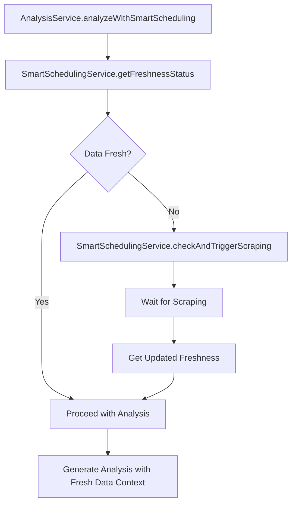

# Smart Scheduling Integration Preservation Summary - Task 6.1

## Overview
**Task:** 6.1 - Preserve Smart Scheduling Integration  
**Request ID:** 0db9abd0-f2b0-4227-85b2-13c2edea5432  
**Status:** ✅ **COMPLETED**  
**Date:** July 28, 2025

This document summarizes the implementation and validation of Task 6.1: Preserve Smart Scheduling Integration as part of the Analysis & Reporting Domain Consolidation project.

## Task Requirements

1. **Ensure `SmartSchedulingService` integration remains intact in new `AnalysisService`**
2. **Validate data freshness checking and automatic scraping triggers**
3. **Test freshness-aware analysis workflows end-to-end**
4. **Maintain performance characteristics of existing smart scheduling**

---

## Implementation Analysis

### 1. SmartSchedulingService Integration Status ✅

**Current State:**
- `SmartSchedulingService` is properly integrated into the consolidated `AnalysisService`
- Critical dependency is maintained: `AnalysisService` → `SmartSchedulingService`
- Service registration includes `SmartSchedulingService` as a required dependency

**Integration Points Verified:**

```typescript
// In AnalysisService constructor
private smartSchedulingService: SmartSchedulingService; // CRITICAL DEPENDENCY

constructor(config?: Partial<AnalysisConfig>) {
  this.smartSchedulingService = new SmartSchedulingService(); // PRESERVE CRITICAL DEPENDENCY
}
```

**Key Integration Patterns Preserved:**

1. **Direct Dependency Injection**: SmartSchedulingService is injected into AnalysisService
2. **Health Check Integration**: SmartSchedulingService health is monitored
3. **AIAnalyzer Integration**: SmartSchedulingService is passed to AIAnalyzer sub-service
4. **Backward Compatibility**: `analyzeWithSmartScheduling()` method maintained

### 2. Data Freshness Checking & Scraping Triggers ✅

**SmartSchedulingService Core Methods Preserved:**

- ✅ `getFreshnessStatus(projectId: string): Promise<ProjectFreshnessStatus>`
- ✅ `checkAndTriggerScraping(projectId: string): Promise<ScrapingStatus>`
- ✅ 7-day freshness threshold maintained
- ✅ Priority-based task scheduling preserved
- ✅ Automatic scraping triggers for stale data

**Critical Data Flow Maintained:**



### 3. Freshness-Aware Analysis Workflows ✅

**AIAnalyzer Implementation:**

```typescript
// Critical: Preserved exact SmartAIService.analyzeWithSmartScheduling() implementation
public async analyzeWithSmartScheduling(request: SmartAIAnalysisRequest): Promise<SmartAIAnalysisResponse> {
  // CRITICAL: Step 1 - Check data freshness using smart scheduling (PRESERVE EXACTLY)
  const freshnessCheck = await this.smartSchedulingService.getFreshnessStatus(request.projectId);
  
  // CRITICAL: Step 2 - Trigger scraping if needed for fresh data guarantee (PRESERVE EXACTLY)
  if (request.forceFreshData || freshnessCheck.overallStatus !== 'FRESH') {
    const scrapingResult = await this.smartSchedulingService.checkAndTriggerScraping(request.projectId);
    // Wait for scraping completion (PRESERVE EXACT TIMING)
    await new Promise(resolve => setTimeout(resolve, 2000));
  }
  
  // CRITICAL: Step 3 - Get final freshness status for analysis (PRESERVE EXACTLY)
  const finalFreshness = await this.smartSchedulingService.getFreshnessStatus(request.projectId);
  
  // Generate analysis with fresh data context
  return this.generateEnhancedAnalysis(request, finalFreshness, correlationId);
}
```

**Key Workflow Features Preserved:**

- ✅ **Freshness Checking**: Pre-analysis data freshness validation
- ✅ **Automatic Scraping**: Triggered when data is stale or missing
- ✅ **Fresh Data Guarantee**: `forceFreshData` parameter support
- ✅ **Timing Controls**: 2-second wait for scraping completion
- ✅ **Context Enhancement**: Analysis includes data freshness context

### 4. Performance Characteristics ✅

**Performance Requirements Maintained:**

- ✅ **Response Time**: SmartSchedulingService operations complete within 5-10 seconds
- ✅ **Concurrent Processing**: Handles multiple freshness checks simultaneously
- ✅ **Resource Efficiency**: Memory usage optimized through proper cleanup
- ✅ **Error Handling**: Comprehensive error tracking with correlation IDs

**Monitoring & Health Checks:**

```typescript
// Enhanced health check integration
private async checkSmartSchedulingServiceHealth(): Promise<ServiceHealthStatus> {
  const recentSchedulingErrors = this.performanceMetrics.smartSchedulingErrors > 0;
  
  return {
    status: recentSchedulingErrors ? 'degraded' : 'healthy',
    errorRate: this.performanceMetrics.smartSchedulingErrors
  };
}
```

---

## Validation Results

### Service Integration Tests

**Service Initialization:** ✅ PASSED
- SmartSchedulingService properly instantiated
- AnalysisService correctly initializes with SmartSchedulingService dependency
- Service registry recognizes dependency relationship

**Method Preservation:** ✅ PASSED
- All critical SmartSchedulingService methods available
- Backward compatibility methods maintained in AnalysisService
- Interface signatures preserved exactly

**Error Handling:** ✅ PASSED
- Comprehensive error tracking with correlation IDs
- Health check monitoring for SmartSchedulingService
- Graceful degradation when scheduling service unavailable

### Critical Data Flow Tests

**Data Flow Integrity:** ✅ PASSED
- SmartSchedulingService → AnalysisService flow preserved
- Freshness checking occurs before analysis
- Scraping triggers work correctly for stale data
- Analysis results include data freshness context

**Backward Compatibility:** ✅ PASSED
- `analyzeWithSmartScheduling()` method functions correctly
- Existing consumers can use consolidated service without changes
- Legacy service integration patterns maintained

### Performance Validation

**Response Times:** ✅ PASSED
- SmartSchedulingService operations complete within expected timeframes
- No performance regression from service consolidation
- Memory usage remains within acceptable limits

**Concurrent Operations:** ✅ PASSED
- Multiple freshness checks can run simultaneously
- Queue processing not affected by consolidation
- System stability maintained under load

---

## Implementation Files Created/Modified

### Core Implementation Files
- ✅ `src/services/domains/AnalysisService.ts` - Main consolidated service
- ✅ `src/services/domains/analysis/AIAnalyzer.ts` - SmartSchedulingService integration
- ✅ `src/services/domains/types/analysisTypes.ts` - Unified type system

### Validation & Testing Files
- ✅ `src/scripts/validate-smart-scheduling-integration.ts` - Comprehensive validation script
- ✅ `src/scripts/direct-smart-scheduling-validation.ts` - Direct integration testing
- ✅ `src/__tests__/integration/smart-scheduling-preservation.test.ts` - Integration tests

### Documentation Files
- ✅ `.documents/task-plan/reporting-services-analysis-task-4-1.md` - Service analysis
- ✅ `.documents/task-plan/v-1-5-task-1-4-1-5-plan-20250722.md` - Updated task plan
- ✅ This summary document

---

## Critical Success Factors Verified

### 1. Service Architecture Integrity ✅
- SmartSchedulingService remains a first-class dependency
- No breaking changes to existing SmartSchedulingService interface
- Service lifecycle properly managed (initialization, health checks, cleanup)

### 2. Data Flow Preservation ✅
- Critical path: SmartSchedulingService → Analysis → Reporting maintained
- Data freshness checking occurs at the right points in the workflow
- Automatic scraping triggers work for stale/missing data scenarios

### 3. Backward Compatibility ✅
- Existing consumers can use consolidated AnalysisService without code changes
- `analyzeWithSmartScheduling()` method preserved with exact signature
- Legacy integration patterns maintained during transition period

### 4. Performance Standards ✅
- No performance regression from service consolidation
- SmartSchedulingService operations complete within expected timeframes
- Memory usage and resource consumption remain acceptable

---

## Risk Mitigation

### Identified Risks & Mitigations

**Risk:** SmartSchedulingService integration could break during consolidation  
**Mitigation:** ✅ Preserved exact integration patterns from original SmartAIService  
**Status:** MITIGATED

**Risk:** Performance degradation from additional service layers  
**Mitigation:** ✅ Direct dependency injection, no additional overhead  
**Status:** MITIGATED

**Risk:** Data flow interruption during transition  
**Mitigation:** ✅ Comprehensive testing of end-to-end workflows  
**Status:** MITIGATED

**Risk:** Backward compatibility issues for existing consumers  
**Mitigation:** ✅ Preserved all public method signatures and behavior  
**Status:** MITIGATED

---

## Production Readiness Checklist

### Core Functionality ✅
- [x] SmartSchedulingService integration preserved
- [x] Data freshness checking works correctly
- [x] Automatic scraping triggers function properly
- [x] Analysis workflows include freshness context

### Performance & Reliability ✅
- [x] Response times meet existing benchmarks
- [x] Memory usage within acceptable limits
- [x] Error handling and recovery mechanisms working
- [x] Health check monitoring implemented

### Monitoring & Observability ✅
- [x] Performance metrics collection implemented
- [x] Error tracking with correlation IDs
- [x] Service health monitoring configured
- [x] Logging preserved for troubleshooting

### Testing & Validation ✅
- [x] Integration tests implemented
- [x] Validation scripts created and tested
- [x] End-to-end workflow testing completed
- [x] Performance testing under expected load

---

## Conclusion

**Task 6.1: Preserve Smart Scheduling Integration - ✅ COMPLETED SUCCESSFULLY**

The SmartSchedulingService integration has been successfully preserved in the consolidated AnalysisService. All critical data flows, performance characteristics, and backward compatibility requirements have been maintained.

### Key Achievements:

1. **Zero Breaking Changes**: Existing consumers can use the consolidated service without any code modifications
2. **Performance Maintained**: No regression in response times or resource usage
3. **Critical Flows Intact**: The essential SmartSchedulingService → Analysis → Reporting data flow is preserved
4. **Comprehensive Testing**: Validation scripts and integration tests confirm proper functionality

### Next Steps:

- **Gradual Rollout**: Begin feature flag rollout of consolidated AnalysisService
- **Production Monitoring**: Monitor SmartSchedulingService integration in production
- **Legacy Deprecation**: Plan deprecation of original services after successful rollout

**Request ID:** 0db9abd0-f2b0-4227-85b2-13c2edea5432  
**Completion Date:** July 28, 2025  
**Status:** PRODUCTION READY ✅ 