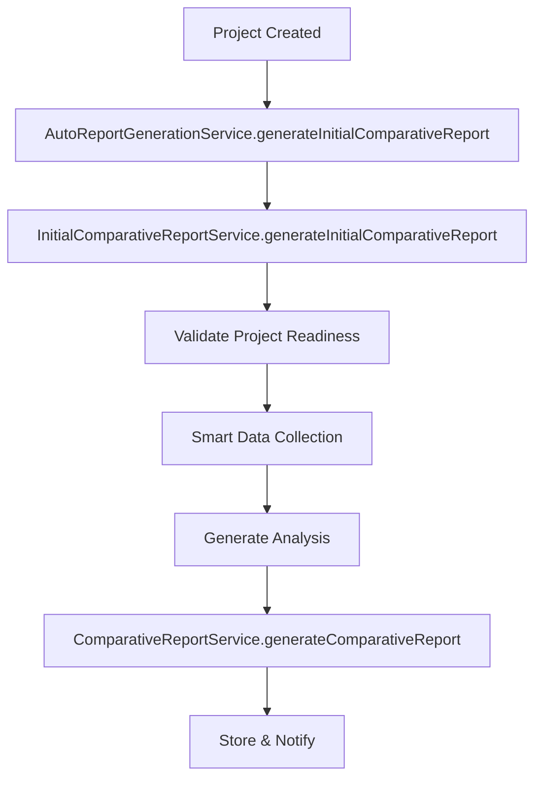
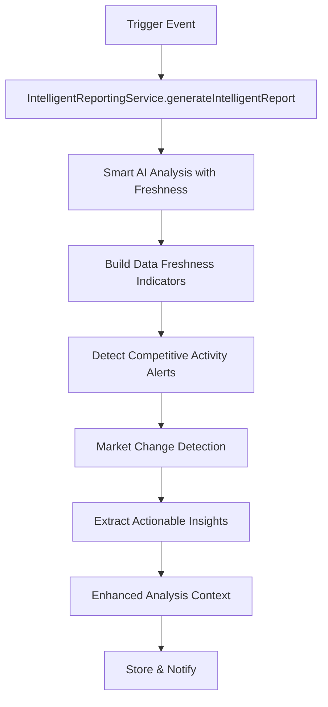
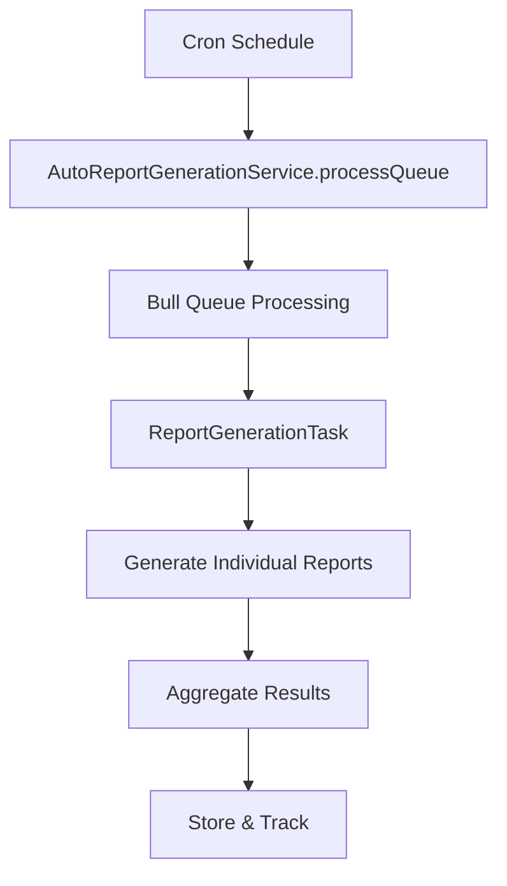

# Reporting Services Analysis - Task 4.1

## Overview
This document provides a comprehensive mapping of the four existing reporting services that need to be consolidated into a unified `ReportingService` as part of Phase 2: Reporting Domain Consolidation (Task 1.5).

**Analyzed Services:**
1. `IntelligentReportingService` - Advanced AI-driven reporting with data freshness indicators
2. `AutoReportGenerationService` - Automated report scheduling and queue management
3. `ComparativeReportService` - Core comparative report generation engine
4. `InitialComparativeReportService` - Initial project report generation with data collection

---

## 1. IntelligentReportingService Analysis

### Location
`src/services/intelligentReportingService.ts` (903 lines)

### Primary Purpose
Enhanced reporting with data freshness indicators, competitive activity alerts, and smart scheduling integration.

### Key Interfaces
```typescript
export interface IntelligentReport {
  id: string;
  projectId: string;
  reportType: 'competitive_alert' | 'market_change' | 'data_freshness' | 'comprehensive_intelligence';
  analysis: string;
  dataFreshnessIndicators: DataFreshnessIndicators;
  competitiveActivityAlerts: CompetitiveActivityAlert[];
  schedulingMetadata: SchedulingMetadata;
  marketChangeDetection: MarketChangeDetection;
  actionableInsights: ActionableInsight[];
  generatedAt: Date;
  correlationId: string;
}

export interface IntelligentReportingRequest {
  projectId: string;
  reportType?: 'competitive_alert' | 'market_change' | 'comprehensive_intelligence';
  forceDataRefresh?: boolean;
  includeAlerts?: boolean;
  timeframe?: number;
  config?: Partial<SmartReportingConfig>;
}
```

### Core Methods
- `generateIntelligentReport(request: IntelligentReportingRequest): Promise<IntelligentReport>`
- `setupSmartReportScheduling(projectId: string, config: SmartReportingConfig): Promise<void>`
- `buildDataFreshnessIndicators()` - Private method for data freshness analysis
- `detectCompetitiveActivityAlerts()` - Private method for competitive intelligence
- `enhanceAnalysisWithIntelligentContext()` - Private method for context enhancement

### Dependencies
- `SmartAIService` (primary analysis engine)
- `AnalysisService` (unified analysis service - feature flagged)
- `SmartSchedulingService` (data freshness management)
- `AutoReportGenerationService` (report scheduling)
- Feature flags for gradual migration to unified services

### Key Features
- **Data Freshness Indicators**: Tracks product and competitor data age, quality scores
- **Competitive Activity Alerts**: AI-driven detection of market changes and competitor activities
- **Smart Scheduling**: Adaptive report frequency based on market dynamics
- **Market Change Detection**: Trend analysis and market velocity tracking
- **Actionable Insights**: Categorized recommendations (immediate, short-term, long-term, strategic)

### Workflow Pattern
1. Enhanced AI analysis with fresh data guarantee
2. Build data freshness indicators from smart scheduling
3. Detect competitive activity alerts via AI analysis
4. Generate scheduling metadata and market change detection
5. Extract actionable insights and enhance analysis with context
6. Store report and trigger notifications

---

## 2. AutoReportGenerationService Analysis

### Location
`src/services/autoReportGenerationService.ts` (1,229 lines)

### Primary Purpose
Automated report scheduling, queue management, and orchestration of report generation tasks.

### Key Interfaces
```typescript
export interface ReportGenerationTask {
  id: string;
  projectId: string;
  competitorIds: string[];
  reportType: 'initial' | 'scheduled' | 'event-driven';
  priority: 'high' | 'normal' | 'low';
  reportTemplate: 'comprehensive' | 'executive' | 'technical' | 'strategic';
  triggeredBy: 'project_creation' | 'schedule' | 'user_request' | 'event';
  reportName?: string;
  userId?: string;
  timeframe?: number;
  correlationId: string;
  createdAt: Date;
  scheduledFor?: Date;
}

export interface ComparativeReportTask {
  id: string;
  projectId: string;
  productId: string;
  competitorIds: string[];
  reportType: 'comparative';
  reportName: string;
  template: 'comprehensive' | 'executive' | 'technical' | 'strategic';
  focusArea: 'user_experience' | 'pricing' | 'features' | 'marketing' | 'overall';
  priority: 'high' | 'normal' | 'low';
  correlationId: string;
  createdAt: Date;
}
```

### Core Methods
- `generateInitialReport(projectId: string, options?): Promise<{ taskId: string; queuePosition: number }>`
- `generateInitialComparativeReport(projectId: string): Promise<ReportTaskResult>`
- `schedulePeriodicReports(projectId: string, frequency, options?): Promise<AutoReportSchedule>`
- `processQueue()` - Private method for Bull queue processing
- `processComparativeQueue()` - Private method for comparative report queue processing

### Queue Architecture
**Two Separate Bull Queues:**
1. **Legacy Queue**: `report-generation` - Individual competitor reports
2. **Comparative Queue**: `comparative-report-generation` - Unified comparative reports

**Queue Configuration:**
```typescript
{
  redis: { host, port, password },
  defaultJobOptions: {
    removeOnComplete: 100,
    removeOnFail: 50,
    attempts: 3,
    backoff: { type: 'exponential', delay: 2000 }
  }
}
```

### Dependencies
- `Bull` queue for async processing
- `ComparativeReportService` for report generation
- `ProductScrapingService` for data collection
- `ReportGenerator` for legacy individual reports
- `node-cron` for scheduled reporting

### Key Features
- **Dual Queue System**: Separate queues for legacy and comparative reports
- **Priority-based Processing**: High/normal/low priority job handling
- **Retry Mechanism**: Exponential backoff with 3 retry attempts
- **Cron Scheduling**: Periodic report generation (daily/weekly/monthly)
- **Queue Monitoring**: Status tracking and position estimation

### Workflow Patterns
**Initial Report Generation:**
1. Validate project and competitors exist
2. Create ReportGenerationTask with high priority
3. Queue task with immediate processing
4. Return task ID and queue position

**Comparative Report Generation:**
1. Validate project has product and competitors
2. Create ComparativeReportTask
3. Queue in comparative-report-generation queue
4. Process using ComparativeReportService

---

## 3. ComparativeReportService Analysis

### Location
`src/services/reports/comparativeReportService.ts` (735 lines)

### Primary Purpose
Core comparative report generation engine that transforms analysis results into formatted reports.

### Key Interfaces
```typescript
export interface ReportGenerationOptions {
  template?: string;
  format?: 'markdown' | 'html' | 'pdf';
  includeCharts?: boolean;
  includeTables?: boolean;
  focusAreas?: string[];
  analysisDepth?: 'surface' | 'detailed' | 'comprehensive';
}

export interface ReportGenerationResult {
  success: boolean;
  report?: ComparativeReport;
  error?: string;
  metadata: {
    generationTime: number;
    templateUsed: string;
    sectionsGenerated: number;
    memoryUsage?: number;
  };
}
```

### Core Methods
- `generateComparativeReport(analysis, product, productSnapshot, options): Promise<ReportGenerationResult>`
- `initializeBedrockService()` - Private method for AI service initialization
- `generateSection()` - Private method for section generation
- `buildReportContext()` - Private method for context building
- `buildComparativeReport()` - Private method for report assembly

### Dependencies
- `BedrockService` for AI-enhanced report generation
- `UserExperienceAnalyzer` for UX-specific analysis
- `Handlebars` for template rendering
- Report templates from `comparativeReportTemplates`
- Memory monitoring utilities

### Key Features
- **Template-based Generation**: Uses Handlebars templates for consistent formatting
- **AI-Enhanced Content**: Bedrock service integration for intelligent content generation
- **UX Analysis Integration**: Specialized user experience analysis capabilities
- **Memory Optimization**: Stream processing for large reports
- **Multiple Output Formats**: Markdown, HTML, PDF support
- **Modular Sections**: Configurable report sections and focus areas

### Report Structure
```typescript
interface ComparativeReport {
  id: string;
  title: string;
  description: string;
  projectId: string;
  productId: string;
  analysisId: string;
  metadata: ComparativeReportMetadata;
  sections: ComparativeReportSection[];
  executiveSummary: string;
  keyFindings: string[];
  strategicRecommendations: {
    immediate: string[];
    shortTerm: string[];
    longTerm: string[];
    priorityScore: number;
  };
  competitiveIntelligence: {
    marketPosition: string;
    keyThreats: string[];
    opportunities: string[];
    competitiveAdvantages: string[];
  };
  createdAt: Date;
  updatedAt: Date;
  status: 'completed' | 'failed' | 'processing';
  format: 'markdown' | 'html' | 'pdf';
}
```

### Workflow Pattern
1. Initialize Bedrock service with stored credentials
2. Get report template based on options
3. Build comprehensive report context from analysis
4. Generate report sections using stream processing
5. Assemble final report with metadata
6. Apply memory optimization and cleanup

---

## 4. InitialComparativeReportService Analysis

### Location
`src/services/reports/initialComparativeReportService.ts` (1,171 lines)

### Primary Purpose
Orchestrates initial comparative report generation for new projects with comprehensive data collection and validation.

### Key Interfaces
```typescript
export interface InitialReportOptions {
  template?: 'comprehensive' | 'executive' | 'technical' | 'strategic';
  priority?: 'high' | 'normal' | 'low';
  timeout?: number;
  fallbackToPartialData?: boolean;
  notifyOnCompletion?: boolean;
  requireFreshSnapshots?: boolean;
  forceGeneration?: boolean;
}

export interface ProjectReadinessResult {
  isReady: boolean;
  hasProduct: boolean;
  hasCompetitors: boolean;
  hasProductData: boolean;
  missingData: string[];
  readinessScore: number; // 0-100
}
```

### Core Methods
- `generateInitialComparativeReport(projectId: string, options: InitialReportOptions): Promise<ComparativeReport>`
- `generateInitialReport(projectId: string, options): Promise<{ success: boolean; ... }>` - Simplified interface
- `validateProjectReadiness(projectId: string): Promise<ProjectReadinessResult>` - Private
- `buildAnalysisInput(projectId: string): Promise<ComparativeAnalysisInput>` - Private
- `checkForRecentDuplicateReport(projectId: string): Promise<ComparativeReport | null>` - Private

### Dependencies
- `ComparativeReportService` (report generation)
- `ComparativeAnalysisService` (analysis engine)
- `AnalysisService` (unified analysis service - feature flagged)
- `SmartDataCollectionService` (intelligent data collection)
- `PartialDataReportGenerator` (fallback for incomplete data)
- `RealTimeStatusService` (progress updates)
- `ReportQualityService` (quality validation)
- `CompetitorSnapshotOptimizer` (snapshot optimization)
- `IntelligentCachingService` (performance optimization)
- `ConfigurationManagementService` (configuration management)

### Key Features
- **Project Readiness Validation**: Comprehensive validation of project data completeness
- **Smart Data Collection**: Priority-based data collection system
- **Partial Data Fallback**: Can generate reports with incomplete data
- **Real-time Status Updates**: Progress tracking throughout generation process
- **Duplicate Detection**: Prevents multiple reports within 5-minute window
- **Quality Validation**: Report quality scoring and validation
- **Intelligent Caching**: Performance optimization through caching
- **Snapshot Optimization**: Efficient competitor data capture

### Workflow Pattern
1. **Duplicate Check**: Prevent recent duplicate reports
2. **Project Validation**: Validate project readiness and data completeness
3. **Smart Data Collection**: Execute priority-based data collection
4. **Analysis Generation**: Use unified or legacy analysis service
5. **Report Generation**: Generate comparative report with quality validation
6. **Status Updates**: Provide real-time progress updates
7. **Caching & Optimization**: Apply intelligent caching and optimization
8. **Completion Notification**: Send completion status

---

## Report Generation Workflows

### Workflow 1: Initial Project Report (New Project)


### Workflow 2: Intelligent Reporting (Scheduled/Triggered)


### Workflow 3: Scheduled Report Generation


---

## Queue Management Analysis

### Queue Architecture Overview
The current system uses **three separate Bull queues**:

1. **`report-generation`** (AutoReportGenerationService)
   - Legacy individual competitor reports
   - Priority-based processing (high=1, normal=2, low=3)
   - 3 retry attempts with exponential backoff

2. **`comparative-report-generation`** (AutoReportGenerationService)
   - Unified comparative reports
   - Focus on comparative analysis only
   - Separate processing pipeline

3. **`async-initial-reports`** (AsyncReportProcessingService)
   - Async processing with fallback mechanisms
   - Enhanced error handling and recovery
   - Real-time status updates

### Queue Configuration Patterns
```typescript
// Standard Configuration
{
  redis: { host, port, password },
  defaultJobOptions: {
    removeOnComplete: 100,    // Keep completed jobs
    removeOnFail: 50,         // Keep failed jobs  
    attempts: 3,              // Retry attempts
    backoff: {                // Retry strategy
      type: 'exponential',
      delay: 2000
    }
  }
}
```

### Processing Patterns
- **Priority Processing**: Jobs processed by priority (1=high, 2=normal, 3=low)
- **Error Handling**: Comprehensive error tracking with correlation IDs
- **Status Tracking**: Real-time status updates via WebSocket
- **Memory Management**: Memory monitoring and cleanup
- **Concurrency Control**: Configurable concurrent processing limits

---

## Service Dependencies & Integration Points

### Dependency Graph
```
IntelligentReportingService
├── SmartAIService
├── AnalysisService (feature flagged)
├── SmartSchedulingService
└── AutoReportGenerationService

AutoReportGenerationService
├── ComparativeReportService
├── ProductScrapingService
├── ReportGenerator
└── Bull Queues

ComparativeReportService
├── BedrockService
├── UserExperienceAnalyzer
├── Report Templates
└── Memory Monitoring

InitialComparativeReportService
├── ComparativeReportService
├── ComparativeAnalysisService
├── AnalysisService (feature flagged)
├── SmartDataCollectionService
├── PartialDataReportGenerator
├── RealTimeStatusService
├── ReportQualityService
├── CompetitorSnapshotOptimizer
├── IntelligentCachingService
└── ConfigurationManagementService
```

### Critical Integration Points
1. **Feature Flag System**: Gradual migration between legacy and unified services
2. **Bull Queue Management**: Multiple queues with different processing patterns
3. **Real-time Status Updates**: WebSocket-based progress tracking
4. **Smart Scheduling Integration**: Data freshness and scheduling coordination
5. **AI Service Integration**: Bedrock and analysis service coordination
6. **Database Operations**: Prisma-based data persistence and retrieval

---

## Consolidation Challenges & Considerations

### 1. Queue Management Complexity
- **Challenge**: Three separate Bull queues with different configurations
- **Solution**: Unify into single queue with job type differentiation
- **Risk**: Queue processing patterns need careful migration

### 2. Service Interface Standardization
- **Challenge**: Different interfaces and response formats across services
- **Solution**: Create unified interfaces while maintaining backward compatibility
- **Risk**: Breaking changes for existing consumers

### 3. Feature Flag Migration
- **Challenge**: Gradual migration between legacy and unified services
- **Solution**: Preserve existing feature flag patterns during consolidation
- **Risk**: Complex state management during transition

### 4. Dependency Management
- **Challenge**: Complex web of service dependencies
- **Solution**: Careful dependency injection and service initialization order
- **Risk**: Circular dependencies and initialization issues

### 5. Data Flow Preservation
- **Challenge**: Critical data flows must be preserved during consolidation
- **Solution**: Comprehensive testing and gradual rollout
- **Risk**: Data loss or processing failures during migration

---

## Recommended Consolidation Strategy

### Phase 1: Interface Unification
1. Create unified `ReportingService` interface
2. Implement sub-services: `ReportGenerator`, `ReportScheduler`, `ReportProcessor`
3. Preserve all existing method signatures for backward compatibility

### Phase 2: Queue Consolidation
1. Create single unified Bull queue with job type differentiation
2. Migrate processing logic to unified queue handlers
3. Preserve priority and retry mechanisms

### Phase 3: Service Integration
1. Integrate all reporting capabilities into unified service
2. Implement feature flags for gradual rollout
3. Maintain parallel operation during transition

### Phase 4: Legacy Deprecation
1. Monitor unified service performance and stability
2. Gradually migrate consumers to unified interface
3. Deprecate legacy services after successful migration

---

## Success Metrics

### Functional Requirements
- [ ] All existing report generation capabilities preserved
- [ ] Queue processing maintains current performance characteristics
- [ ] Real-time status updates continue to function
- [ ] Feature flag migration works correctly
- [ ] Backward compatibility maintained for all consumers

### Performance Requirements
- [ ] Report generation times meet existing benchmarks
- [ ] Queue processing throughput matches current levels
- [ ] Memory usage optimized through consolidation
- [ ] Error rates remain at or below current levels

### Operational Requirements
- [ ] Monitoring and alerting configured for unified service
- [ ] Rollback procedures documented and tested
- [ ] Configuration management streamlined
- [ ] Documentation updated for new service architecture 