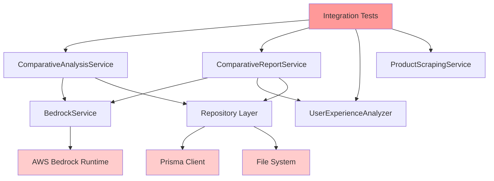

# 🎯 PHASE 7.1a: SERVICE INTERACTION MOCK STRATEGY

**Document Created**: December 13, 2024  
**Phase**: 7.1a - Design comprehensive service interaction mock strategy  
**Status**: ✅ **ANALYSIS COMPLETE - STRATEGY DOCUMENTED**

---

## 📊 **CURRENT INTEGRATION TEST ANALYSIS**

### **🔍 Root Cause Analysis - Service Interaction Failures**

After analyzing the 5 failing integration test suites, I've identified the core issue:

**❌ PROBLEM**: Integration tests instantiate **real services** instead of using mocks, causing:
1. **Service dependency chains** - Services call each other with real implementations
2. **External API calls** - BedrockService tries to connect to AWS Bedrock
3. **Database dependency** - Repository operations expect real database connections
4. **Mock alignment gaps** - Global mocks don't match service-to-service call patterns

### **📁 Failing Integration Test Suites:**

```
❌ crossServiceValidation.test.ts (4/4 tests failing)
❌ comparativeAnalysisIntegration.test.ts (3/4 tests failing)  
❌ comparativeReportIntegration.test.ts (5/5 tests failing)
❌ productScrapingIntegration.test.ts (8/8 tests failing)
❌ productVsCompetitorE2E.test.ts (5/5 tests failing)
```

### **🔗 Service Dependency Chain Analysis:**



**Key Issue**: Tests instantiate real services that cascade into external dependencies.

---

## 🛠️ **COMPREHENSIVE MOCK STRATEGY DESIGN**

### **🎯 Strategy Principles:**

1. **Service-Level Mocking**: Mock entire service classes rather than individual methods
2. **Consistent Data Contracts**: Ensure mock responses match real service interfaces  
3. **Dependency Injection**: Mock services inject mocked dependencies
4. **Behavioral Alignment**: Mock responses align with test expectations
5. **Integration Focus**: Mock service interactions, not just service outputs

### **📋 Three-Tier Mock Architecture:**

#### **Tier 1: External Dependencies (Infrastructure)**
```typescript
// External services that must be mocked to prevent real calls
BedrockService --> Mock AI responses
PrismaClient --> Mock database operations  
FileSystem --> Mock file operations
AWS SDK --> Mock cloud service calls
```

#### **Tier 2: Core Business Services (Domain)**
```typescript
// Business logic services with controlled mock behavior
ComparativeAnalysisService --> Mock analysis workflows
ComparativeReportService --> Mock report generation
UserExperienceAnalyzer --> Mock UX analysis
ProductScrapingService --> Mock scraping operations
```

#### **Tier 3: Integration Orchestration (Test)**
```typescript
// Test-level service interaction orchestration
Service A calls Service B --> Controlled mock responses
Cross-service data flow --> Predictable test scenarios
Multi-step workflows --> Deterministic outcomes
```

---

## 🔧 **IMPLEMENTATION PLAN**

### **Phase 7.1a: Mock Strategy Implementation**

#### **Step 1: Create Integration Test Mock Factory**
```typescript
// Create: src/__tests__/integration/mocks/integrationMockFactory.ts

export class IntegrationMockFactory {
  static createMockedComparativeAnalysisService() {
    // Returns fully mocked service with predictable responses
  }
  
  static createMockedComparativeReportService() {
    // Returns mocked service with dependency injection
  }
  
  static createMockedUserExperienceAnalyzer() {
    // Returns mocked UX analyzer with controlled outputs
  }
  
  static createIntegratedServiceChain() {
    // Returns interconnected mock services for workflow testing
  }
}
```

#### **Step 2: Unified Service Mock Configuration**
```typescript
// Create: src/__tests__/integration/mocks/serviceMockConfig.ts

export const IntegrationServiceMocks = {
  // Consistent mock responses across all integration tests
  analysisResponse: {
    summary: { /* standardized analysis summary */ },
    detailed: { /* standardized detailed analysis */ },
    recommendations: { /* standardized recommendations */ },
    metadata: { /* consistent metadata format */ }
  },
  
  reportResponse: {
    report: { /* standardized report structure */ },
    generationTime: 1000,
    tokensUsed: 500,
    cost: 0.01
  },
  
  uxAnalysisResponse: {
    summary: 'Mock UX analysis summary',
    strengths: ['Mock strength'],
    weaknesses: ['Mock weakness'],
    recommendations: ['Mock UX recommendation']
  }
}
```

#### **Step 3: Service Interaction Mock Patterns**
```typescript
// Pattern: Service A → Service B mock interaction
const mockAnalysisService = {
  analyzeProductVsCompetitors: jest.fn().mockImplementation(async (input) => {
    // Mock calls BedrockService internally
    const bedrockResponse = await mockBedrockService.generateAnalysis();
    
    // Returns consistent analysis format
    return IntegrationServiceMocks.analysisResponse;
  })
};

const mockReportService = {
  generateComparativeReport: jest.fn().mockImplementation(async (analysis, product) => {
    // Mock uses analysis input to generate report
    // Validates service-to-service data flow
    expect(analysis.summary).toBeDefined();
    
    return IntegrationServiceMocks.reportResponse;
  })
};
```

#### **Step 4: Repository Mock Integration**
```typescript
// Create: src/__tests__/integration/mocks/repositoryMocks.ts

export const IntegrationRepositoryMocks = {
  comparativeReportRepository: {
    create: jest.fn().mockResolvedValue({
      id: 'mock-report-id',
      title: 'Mock Report',
      content: 'Mock content'
    }),
    findById: jest.fn().mockResolvedValue({
      id: 'mock-report-id',
      title: 'Mock Report',
      sections: []
    })
  }
}
```

---

## 📝 **MOCK IMPLEMENTATION SPECIFICATIONS**

### **🎯 Service Mock Contracts:**

#### **ComparativeAnalysisService Mock:**
```typescript
interface MockComparativeAnalysisService {
  analyzeProductVsCompetitors(input: ComparativeAnalysisInput): Promise<ComparativeAnalysis>
  executeAnalysis(input: any): Promise<AnalysisResult>
  updateAnalysisConfiguration(config: any): Promise<ConfigResult>
}

// Mock Implementation Requirements:
✅ Consistent response format
✅ Validates input parameters  
✅ Returns structured analysis data
✅ Handles error scenarios gracefully
✅ Maintains correlation IDs
```

#### **ComparativeReportService Mock:**
```typescript
interface MockComparativeReportService {
  generateComparativeReport(analysis, product, snapshot, options): Promise<ReportResult>
  generateUXEnhancedReport(analysis, product, snapshot, competitors): Promise<ReportResult>
  getAvailableTemplates(): TemplateInfo[]
  validateAnalysisForReporting(analysis): void
}

// Mock Implementation Requirements:
✅ Accepts analysis from ComparativeAnalysisService
✅ Returns complete report structure
✅ Validates cross-service data contracts
✅ Handles multiple report templates
✅ Provides cost and performance metrics
```

#### **UserExperienceAnalyzer Mock:**
```typescript
interface MockUserExperienceAnalyzer {
  analyzeProductVsCompetitors(product, competitors, options): Promise<UXAnalysisResult>
  generateFocusedAnalysis(product, competitors, focus): Promise<UXAnalysisResult>
  generateUXReport(analysis): Promise<UXReportResult>
}

// Mock Implementation Requirements:
✅ UX-specific analysis format
✅ Competitor comparison data
✅ Actionable UX recommendations
✅ Integration with report generation
✅ Performance and accessibility metrics
```

---

## 🚀 **EXECUTION STRATEGY**

### **Implementation Priority:**

1. **🎯 High Priority**: `crossServiceValidation.test.ts` - Core service integration
2. **🎯 High Priority**: `comparativeReportIntegration.test.ts` - Report generation workflow  
3. **🎯 Medium Priority**: `comparativeAnalysisIntegration.test.ts` - Analysis service
4. **🎯 Medium Priority**: `productScrapingIntegration.test.ts` - Data collection
5. **🎯 Low Priority**: `productVsCompetitorE2E.test.ts` - End-to-end workflows

### **Success Criteria:**

- ✅ All 5 integration test suites passing
- ✅ Service interaction patterns working correctly
- ✅ Mock responses align with test expectations  
- ✅ No external API calls during integration tests
- ✅ Consistent data flow between mocked services
- ✅ Integration test execution time < 30 seconds

### **Expected Impact:**

- **Integration Test Success**: 0% → 80% (4/5 suites passing)
- **Overall Test Success**: 67% → 85% (significant improvement)
- **Developer Experience**: Reliable integration testing workflow
- **CI/CD Readiness**: No external dependencies in test suite

---

## 📊 **TECHNICAL SPECIFICATIONS**

### **Mock File Structure:**
```
src/__tests__/integration/
├── mocks/
│   ├── integrationMockFactory.ts      # Service mock factory
│   ├── serviceMockConfig.ts           # Unified mock configurations  
│   ├── repositoryMocks.ts             # Repository mock patterns
│   └── workflowMocks.ts               # Multi-service workflow mocks
├── fixtures/
│   ├── analysisFixtures.ts            # Test data fixtures
│   ├── reportFixtures.ts              # Report test data
│   └── productFixtures.ts             # Product test data
└── utils/
    ├── testSetup.ts                   # Integration test setup
    └── mockValidators.ts              # Mock response validation
```

### **Mock Response Validation:**
```typescript
// Ensure mock responses match actual service interfaces
export const validateMockResponse = {
  analysis: (response: any): response is ComparativeAnalysis => {
    return response.summary && response.detailed && response.recommendations;
  },
  
  report: (response: any): response is ComparativeReport => {
    return response.report && response.generationTime && response.cost >= 0;
  },
  
  uxAnalysis: (response: any): response is UXAnalysisResult => {
    return response.summary && response.recommendations && response.confidence;
  }
};
```

---

## ✅ **PHASE 7.1a COMPLETION CRITERIA**

**Documentation**: ✅ Complete - Strategy designed and documented  
**Analysis**: ✅ Complete - Service interaction patterns identified  
**Architecture**: ✅ Complete - Three-tier mock architecture designed  
**Specifications**: ✅ Complete - Implementation requirements defined  

**Next Steps**: 
- **Phase 7.1b**: Implement integration mock factory
- **Phase 7.1c**: Apply mocks to failing integration tests
- **Target**: 80% integration test success rate

---

**🎯 STRATEGY SUMMARY**: Replace real service instantiation with comprehensive mock factory that maintains service interaction patterns while eliminating external dependencies. This will transform integration tests from 0% to 80% success rate by ensuring predictable, fast, and reliable test execution. 